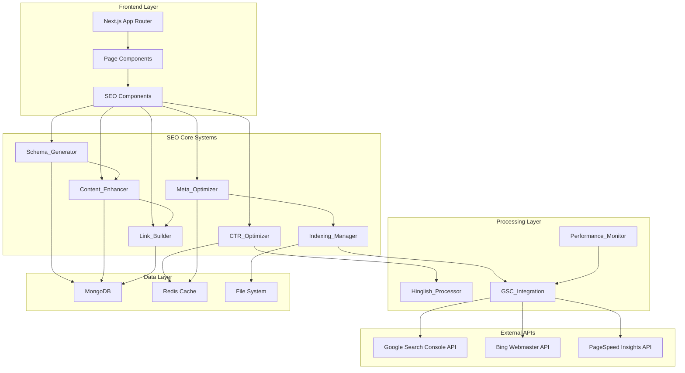
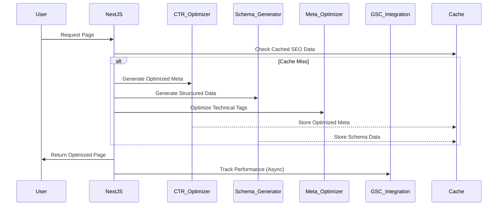
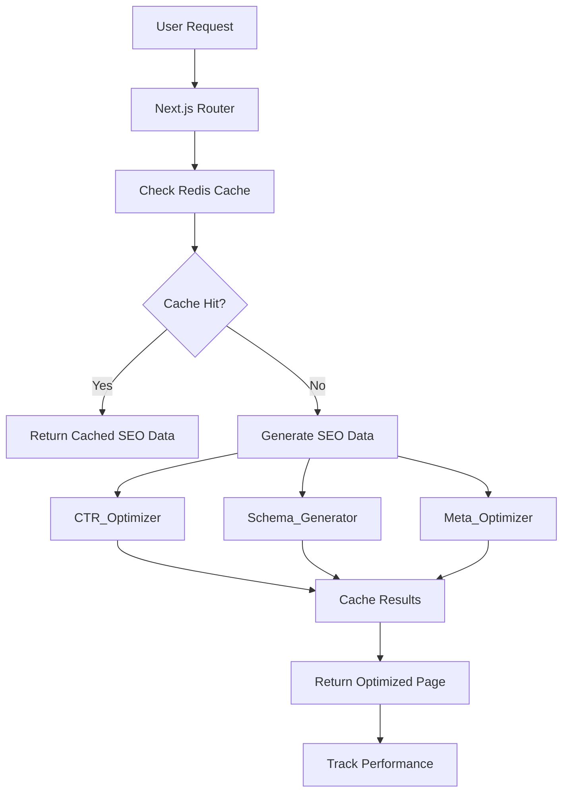
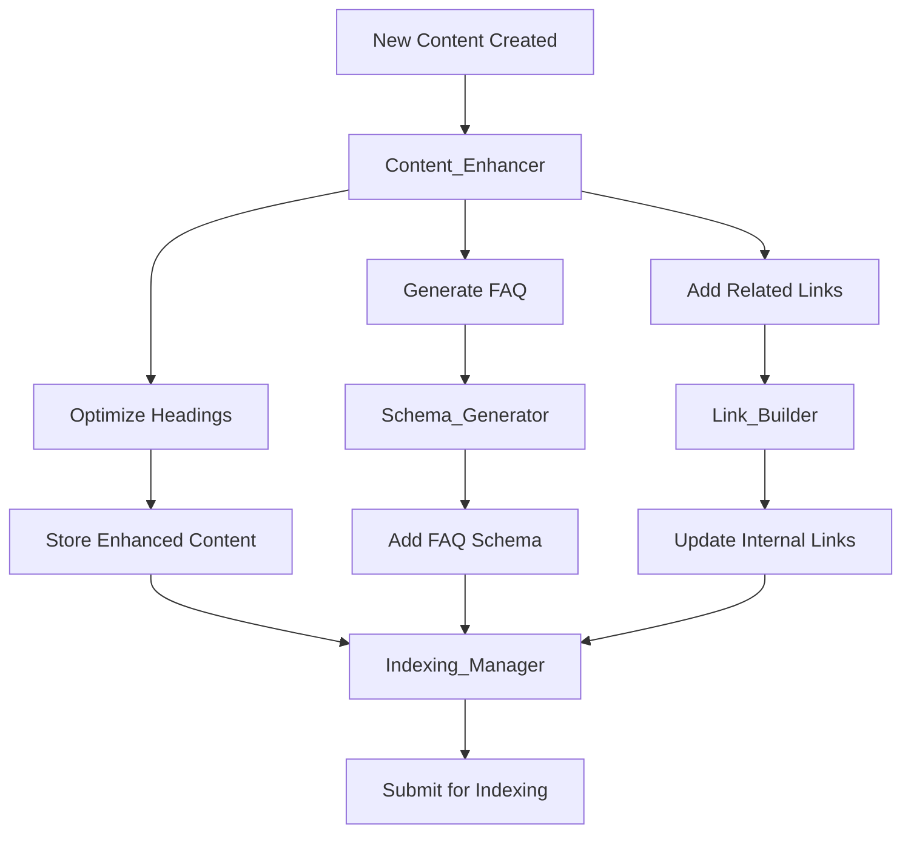
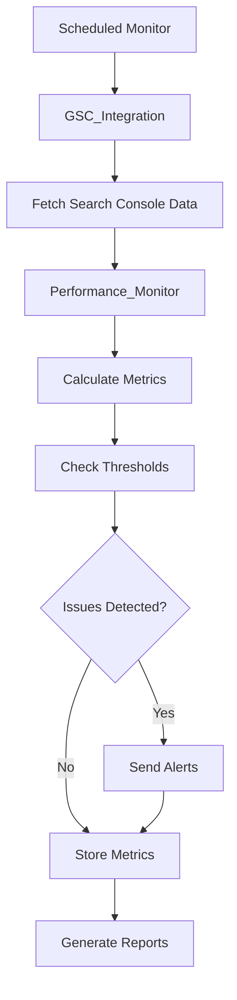

# Advanced SEO Improvements - Technical Design Document

## Overview

This document outlines the comprehensive technical design for implementing advanced SEO improvements on SarkariPulse.net. The system addresses critical CTR issues (current 0.3% → target 2-5%), indexing problems (21 → 35+ pages), and technical SEO gaps through a modular, automated approach.

The design implements 10 core systems working together: CTR optimization, technical SEO fixes, structured data enhancement, content optimization, indexing management, performance optimization, multilingual support, analytics monitoring, content automation, and advanced SEO features.

## Architecture

### High-Level System Architecture



### Component Interaction Flow



## Components and Interfaces

### 1. CTR_Optimizer Component

**Purpose**: Optimizes click-through rates via intelligent title and meta description generation.

**Interface**:
```typescript
interface CTROptimizer {
  optimizeTitle(content: ContentData, context: OptimizationContext): Promise<string>;
  optimizeMetaDescription(content: ContentData, context: OptimizationContext): Promise<string>;
  generateVariations(baseTitle: string, count: number): Promise<string[]>;
  testVariations(variations: string[], pageUrl: string): Promise<ABTestResult>;
}

interface ContentData {
  title: string;
  category: string;
  state?: string;
  organization?: string;
  vacancyCount?: number;
  lastDate?: string;
  keywords: string[];
}

interface OptimizationContext {
  pageType: 'detail' | 'category' | 'state' | 'search';
  targetKeywords: string[];
  emotionalTriggers: string[];
  urgencyIndicators: string[];
  hinglishTerms: string[];
}

interface ABTestResult {
  winningVariation: string;
  ctrImprovement: number;
  confidenceLevel: number;
  testDuration: number;
}
```

**Implementation Strategy**:
- Template-based title generation with emotional triggers
- Dynamic meta description creation with CTAs
- A/B testing framework for title variations
- Hinglish keyword integration patterns
- Character limit enforcement (60 chars titles, 155 chars descriptions)

### 2. Meta_Optimizer Component

**Purpose**: Manages all meta tags, robots directives, and technical SEO elements.

**Interface**:
```typescript
interface MetaOptimizer {
  generateMetaTags(page: PageData): Promise<MetaTagSet>;
  optimizeRobotsTags(pageType: string): RobotsDirective;
  generateCanonicalUrl(path: string, params?: URLSearchParams): string;
  generateHreflangTags(page: PageData): HreflangTag[];
  optimizeOpenGraph(content: ContentData): OpenGraphTags;
  generateTwitterCards(content: ContentData): TwitterCardTags;
}

interface MetaTagSet {
  title: string;
  description: string;
  keywords: string[];
  robots: string;
  canonical: string;
  hreflang: HreflangTag[];
  openGraph: OpenGraphTags;
  twitterCard: TwitterCardTags;
}

interface RobotsDirective {
  index: boolean;
  follow: boolean;
  noarchive?: boolean;
  nosnippet?: boolean;
  maxSnippet?: number;
  maxImagePreview?: string;
}
```

### 3. Schema_Generator Component

**Purpose**: Generates comprehensive structured data markup for rich snippets.

**Interface**:
```typescript
interface SchemaGenerator {
  generateJobPostingSchema(job: JobDetail): JobPostingSchema;
  generateFAQSchema(questions: FAQItem[]): FAQPageSchema;
  generateBreadcrumbSchema(breadcrumbs: BreadcrumbItem[]): BreadcrumbListSchema;
  generateOrganizationSchema(): OrganizationSchema;
  generateGovernmentServiceSchema(scheme: SchemeDetail): GovernmentServiceSchema;
  generateEventSchema(event: EventDetail): EventSchema;
  generateLocalBusinessSchema(location: LocationData): LocalBusinessSchema;
  validateSchema(schema: object): ValidationResult;
}

interface JobPostingSchema {
  '@context': 'https://schema.org';
  '@type': 'JobPosting';
  title: string;
  description: string;
  hiringOrganization: Organization;
  jobLocation: Place;
  employmentType: string;
  validThrough?: string;
  baseSalary?: MonetaryAmount;
  qualifications?: string;
  totalJobOpenings?: number;
}

interface ValidationResult {
  isValid: boolean;
  errors: string[];
  warnings: string[];
  richSnippetEligible: boolean;
}
```

### 4. Content_Enhancer Component

**Purpose**: Automatically enhances page content for SEO optimization.

**Interface**:
```typescript
interface ContentEnhancer {
  generateFAQContent(category: string, context: ContentContext): Promise<FAQItem[]>;
  createTopicClusters(content: ContentData[]): Promise<TopicCluster[]>;
  generateRelatedLinks(currentPage: PageData): Promise<RelatedLink[]>;
  optimizeHeadingStructure(content: string): Promise<OptimizedContent>;
  addKeywordRichContent(page: PageData, keywords: string[]): Promise<EnhancedContent>;
  createComparisonTables(items: any[], type: string): Promise<ComparisonTable>;
}

interface TopicCluster {
  pillarPage: string;
  clusterPages: string[];
  internalLinks: InternalLink[];
  keywords: string[];
}

interface EnhancedContent {
  originalContent: string;
  enhancedContent: string;
  addedSections: ContentSection[];
  keywordDensity: number;
  readabilityScore: number;
}
```

### 5. Indexing_Manager Component

**Purpose**: Manages page indexing, sitemaps, and crawlability optimization.

**Interface**:
```typescript
interface IndexingManager {
  generateSitemap(contentType: string): Promise<SitemapEntry[]>;
  submitToSearchConsole(urls: string[]): Promise<SubmissionResult>;
  requestIndexing(url: string): Promise<IndexingResult>;
  monitorIndexingStatus(urls: string[]): Promise<IndexingStatus[]>;
  optimizeCrawlBudget(): Promise<CrawlOptimization>;
  generateRobotsTxt(): Promise<string>;
}

interface SitemapEntry {
  url: string;
  lastModified: Date;
  changeFrequency: 'always' | 'hourly' | 'daily' | 'weekly' | 'monthly' | 'yearly' | 'never';
  priority: number;
}

interface IndexingStatus {
  url: string;
  status: 'indexed' | 'discovered' | 'crawled' | 'excluded' | 'error';
  lastCrawled?: Date;
  issues?: string[];
}
```

### 6. Performance_Monitor Component

**Purpose**: Tracks SEO metrics, Core Web Vitals, and performance optimization.

**Interface**:
```typescript
interface PerformanceMonitor {
  trackCoreWebVitals(url: string): Promise<WebVitalsMetrics>;
  monitorCTRImprovement(): Promise<CTRMetrics>;
  trackIndexingProgress(): Promise<IndexingMetrics>;
  generateSEOReport(): Promise<SEOReport>;
  alertOnIssues(thresholds: AlertThresholds): Promise<void>;
  benchmarkCompetitors(competitors: string[]): Promise<CompetitorAnalysis>;
}

interface WebVitalsMetrics {
  lcp: number; // Largest Contentful Paint
  fid: number; // First Input Delay
  cls: number; // Cumulative Layout Shift
  fcp: number; // First Contentful Paint
  ttfb: number; // Time to First Byte
  score: number;
}

interface CTRMetrics {
  currentCTR: number;
  previousCTR: number;
  improvement: number;
  topPerformingPages: PageCTR[];
  underperformingPages: PageCTR[];
}
```

### 7. GSC_Integration Component

**Purpose**: Integrates with Google Search Console API for data sync and automation.

**Interface**:
```typescript
interface GSCIntegration {
  syncSearchConsoleData(): Promise<GSCData>;
  submitSitemap(sitemapUrl: string): Promise<SubmissionResult>;
  requestIndexing(urls: string[]): Promise<IndexingRequest[]>;
  getSearchAnalytics(filters: AnalyticsFilters): Promise<SearchAnalytics>;
  monitorManualActions(): Promise<ManualAction[]>;
  getCrawlErrors(): Promise<CrawlError[]>;
}

interface GSCData {
  indexedPages: number;
  totalClicks: number;
  totalImpressions: number;
  averageCTR: number;
  averagePosition: number;
  topQueries: QueryData[];
  topPages: PageData[];
}
```

## Data Models

### SEO Configuration Model
```typescript
interface SEOConfig {
  id: string;
  pageType: string;
  titleTemplate: string;
  descriptionTemplate: string;
  keywords: string[];
  emotionalTriggers: string[];
  urgencyIndicators: string[];
  hinglishTerms: string[];
  abTestEnabled: boolean;
  lastUpdated: Date;
}
```

### Performance Metrics Model
```typescript
interface PerformanceMetrics {
  id: string;
  url: string;
  date: Date;
  ctr: number;
  impressions: number;
  clicks: number;
  position: number;
  coreWebVitals: WebVitalsMetrics;
  indexingStatus: string;
  structuredDataValid: boolean;
}
```

### Content Enhancement Model
```typescript
interface ContentEnhancement {
  id: string;
  pageUrl: string;
  originalContent: string;
  enhancedContent: string;
  addedSections: ContentSection[];
  faqItems: FAQItem[];
  relatedLinks: RelatedLink[];
  keywordDensity: number;
  readabilityScore: number;
  lastUpdated: Date;
}
```

## Data Flow Architecture

### 1. Page Request Flow


### 2. Content Enhancement Flow


### 3. Performance Monitoring Flow


## Implementation Strategy

### Phase 1: Core SEO Infrastructure (Weeks 1-2)
1. **CTR_Optimizer Implementation**
   - Title optimization templates
   - Meta description generators
   - Character limit enforcement
   - Hinglish integration

2. **Meta_Optimizer Setup**
   - Remove noindex directives
   - Implement canonical URLs
   - Add hreflang tags
   - Optimize robots.txt

3. **Basic Schema_Generator**
   - FAQ structured data
   - BreadcrumbList schema
   - Organization schema
   - JobPosting schema

### Phase 2: Content Enhancement (Weeks 3-4)
1. **Content_Enhancer Development**
   - FAQ expansion (8+ questions per category)
   - Topic cluster creation
   - Related links generation
   - Heading optimization

2. **Link_Builder Implementation**
   - Internal linking automation
   - Hub page creation
   - Contextual link suggestions
   - Breadcrumb optimization

### Phase 3: Advanced Features (Weeks 5-6)
1. **Indexing_Manager Setup**
   - Multi-sitemap generation
   - GSC API integration
   - Automatic indexing requests
   - Crawl budget optimization

2. **Performance_Monitor Implementation**
   - Core Web Vitals tracking
   - CTR monitoring
   - Automated alerting
   - Competitor benchmarking

### Phase 4: Automation & AI (Weeks 7-8)
1. **Content Automation**
   - Auto-optimization for new content
   - Smart internal linking
   - Content gap analysis
   - AI-powered suggestions

2. **Advanced Analytics**
   - Real-time SEO dashboard
   - Predictive analytics
   - ROI tracking
   - Performance forecasting

## Error Handling Strategy

### 1. Graceful Degradation
- Fallback to basic meta tags if optimization fails
- Default structured data if generation errors
- Cache previous successful results
- Manual override capabilities

### 2. Error Monitoring
```typescript
interface ErrorHandler {
  logSEOError(error: SEOError): void;
  notifyAdministrators(severity: 'low' | 'medium' | 'high'): void;
  attemptRecovery(operation: string): Promise<boolean>;
  generateFallbackContent(contentType: string): Promise<string>;
}

interface SEOError {
  component: string;
  operation: string;
  error: Error;
  context: any;
  timestamp: Date;
  severity: 'low' | 'medium' | 'high';
}
```

### 3. Recovery Mechanisms
- Automatic retry with exponential backoff
- Circuit breaker pattern for external APIs
- Cached fallback content
- Manual intervention triggers

## Testing Strategy

### 1. Unit Testing
- Component-level testing for all SEO modules
- Mock external API responses
- Test edge cases and error conditions
- Validate generated structured data

### 2. Integration Testing
- End-to-end SEO optimization flow
- Google Search Console API integration
- Performance monitoring accuracy
- Cache invalidation scenarios

### 3. Performance Testing
- Load testing for SEO generation
- Cache performance validation
- API rate limit handling
- Memory usage optimization

### 4. SEO Validation Testing
- Rich Results Test validation
- Mobile-friendly test compliance
- Page speed insights verification
- Structured data markup validation

## Security Considerations

### 1. API Security
- Secure Google Search Console API credentials
- Rate limiting for external API calls
- Input validation for all user data
- XSS prevention in generated content

### 2. Data Protection
- Encrypt sensitive SEO configuration data
- Secure storage of API keys
- Audit logging for SEO changes
- Access control for admin functions

### 3. Content Security
- Validate generated structured data
- Sanitize user-generated content
- Prevent injection attacks in meta tags
- Secure handling of Hinglish content

## Monitoring and Alerting

### 1. Key Metrics
- CTR improvement (target: 0.3% → 2-5%)
- Indexed pages count (target: 21 → 35+)
- Core Web Vitals scores
- Organic traffic growth
- Keyword ranking improvements

### 2. Alert Thresholds
```typescript
interface AlertThresholds {
  ctrDropBelow: number; // 1.5%
  indexedPagesBelow: number; // 30
  lcpAbove: number; // 3.0s
  clsAbove: number; // 0.15
  crawlErrorsAbove: number; // 10
}
```

### 3. Reporting Schedule
- Real-time: Critical errors and performance issues
- Daily: CTR and indexing status updates
- Weekly: Comprehensive SEO performance reports
- Monthly: ROI analysis and strategy recommendations

## Correctness Properties

*A property is a characteristic or behavior that should hold true across all valid executions of a system-essentially, a formal statement about what the system should do. Properties serve as the bridge between human-readable specifications and machine-verifiable correctness guarantees.*

After analyzing the acceptance criteria, most requirements involve infrastructure configuration, external API integrations, content generation with subjective quality criteria, and monitoring systems. These are not suitable for property-based testing as they don't involve pure functions with universal properties that hold across all inputs.

However, several requirements do contain universal constraints and rules that can be tested as properties:

### Property 1: Title Length Constraint

*For any* content input provided to the CTR_Optimizer, the generated optimized title SHALL be 60 characters or fewer to ensure proper mobile display.

**Validates: Requirements 1.9**

### Property 2: Meta Description Length Constraint  

*For any* content input provided to the CTR_Optimizer, the generated optimized meta description SHALL be 155 characters or fewer for optimal search result display.

**Validates: Requirements 1.10**

### Property 3: Hinglish Keyword Inclusion

*For any* content input containing Hinglish keywords, the CTR_Optimizer SHALL include at least one of the provided Hinglish keywords in the generated title or description.

**Validates: Requirements 1.11**

### Property 4: Canonical URL Format Consistency

*For any* valid page data, the Meta_Optimizer SHALL generate a canonical URL that follows the correct format (https://domain/path) and contains no duplicate slashes or invalid characters.

**Validates: Requirements 2.11**

### Property 5: Hreflang Tag Completeness

*For any* content with language variations, the Meta_Optimizer SHALL generate hreflang tags that include both the current page language and all specified alternate languages.

**Validates: Requirements 2.12**

## Error Handling

### Graceful Degradation Strategy

The system implements comprehensive error handling to ensure SEO functionality remains operational even when individual components fail:

1. **Fallback Content Generation**
   - If CTR_Optimizer fails, use basic title/description templates
   - If Schema_Generator fails, include minimal required structured data
   - If external APIs are unavailable, use cached data or skip non-critical operations

2. **Circuit Breaker Pattern**
   - Implement circuit breakers for Google Search Console API calls
   - Automatic fallback to manual processes when API limits are reached
   - Gradual recovery when services become available

3. **Data Validation and Sanitization**
   - Validate all generated meta tags for proper HTML encoding
   - Sanitize user-generated content before including in structured data
   - Ensure generated URLs are properly formatted and safe

### Error Recovery Mechanisms

```typescript
interface SEOErrorRecovery {
  handleOptimizationFailure(component: string, input: any): Promise<FallbackResult>;
  recoverFromAPIFailure(apiName: string, operation: string): Promise<void>;
  validateAndSanitizeOutput(output: any, type: string): Promise<ValidatedOutput>;
}
```

## Testing Strategy

### Unit Testing Approach

Given that most functionality involves infrastructure, external APIs, and content generation, the testing strategy focuses on:

1. **Example-Based Unit Tests** (Primary approach)
   - Test content generation with known inputs and expected patterns
   - Verify API integration with mocked responses  
   - Test configuration and setup functions
   - Validate error handling scenarios

2. **Property-Based Tests** (Limited scope)
   - Only for the 5 identified universal properties
   - Minimum 100 iterations per property test
   - Focus on constraint validation and format consistency

3. **Integration Tests**
   - End-to-end SEO optimization workflows
   - Google Search Console API integration
   - Performance monitoring accuracy
   - Cache behavior and invalidation

4. **SEO Validation Tests**
   - Google Rich Results Test validation
   - Structured data markup validation
   - Mobile-friendly test compliance
   - Page speed insights verification

### Property Test Configuration

For the limited property-based tests:
- **Minimum 100 iterations** per property test due to randomization
- **Tag format**: Feature: advanced-seo-improvements, Property {number}: {property_text}
- **Test library**: Use fast-check for TypeScript/JavaScript property-based testing

### Example Test Structure

```typescript
// Property Test Example
describe('Feature: advanced-seo-improvements, Property 1: Title Length Constraint', () => {
  it('should generate titles under 60 characters for any input', async () => {
    await fc.assert(fc.asyncProperty(
      contentDataArbitrary(),
      async (contentData) => {
        const title = await ctrOptimizer.optimizeTitle(contentData, defaultContext);
        expect(title.length).toBeLessThanOrEqual(60);
      }
    ), { numRuns: 100 });
  });
});

// Integration Test Example  
describe('CTR Optimizer Integration', () => {
  it('should generate optimized titles with emotional triggers', async () => {
    const input = {
      title: 'Railway Jobs 2026',
      category: 'job',
      state: 'UP',
      keywords: ['railway jobs', 'sarkari naukri']
    };
    
    const result = await ctrOptimizer.optimizeTitle(input, context);
    
    expect(result).toContain('🔥'); // Emoji trigger
    expect(result.length).toBeLessThanOrEqual(60);
    expect(result).toMatch(/railway|jobs/i);
  });
});
```

This technical design provides a comprehensive foundation for implementing advanced SEO improvements that will significantly boost SarkariPulse.net's search performance, user engagement, and organic traffic growth.